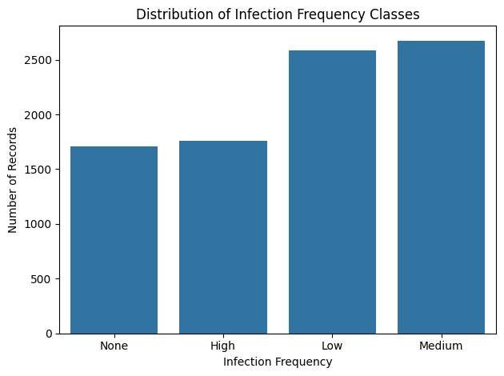
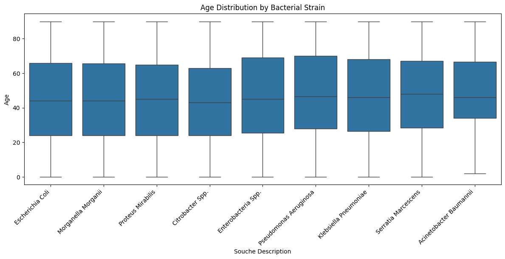
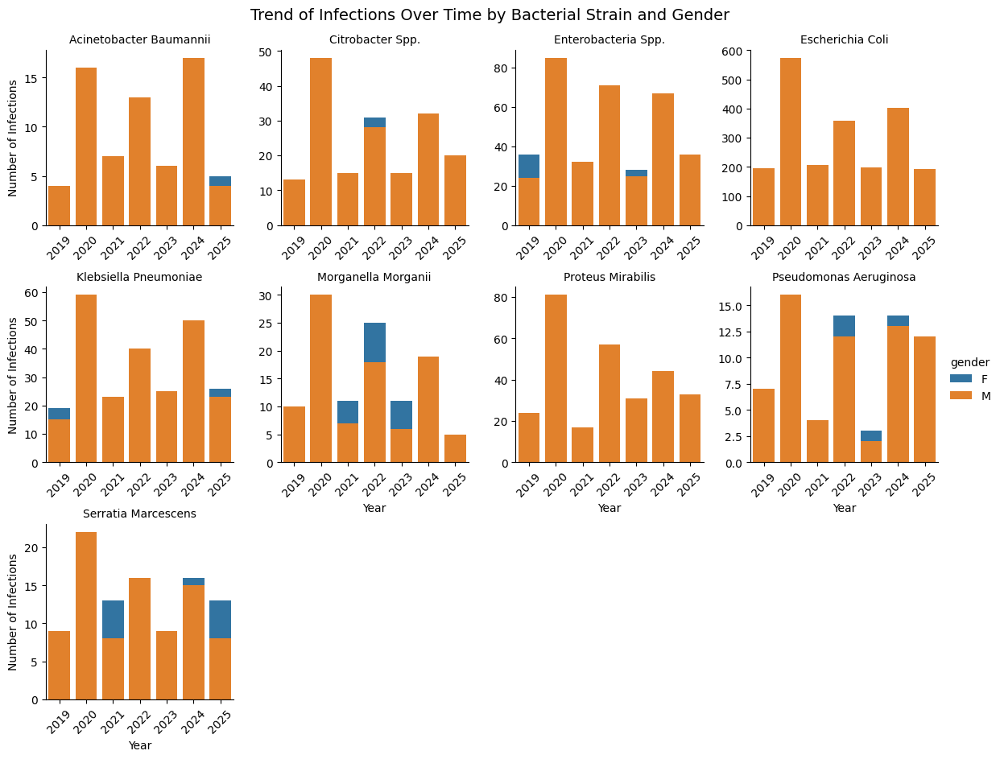
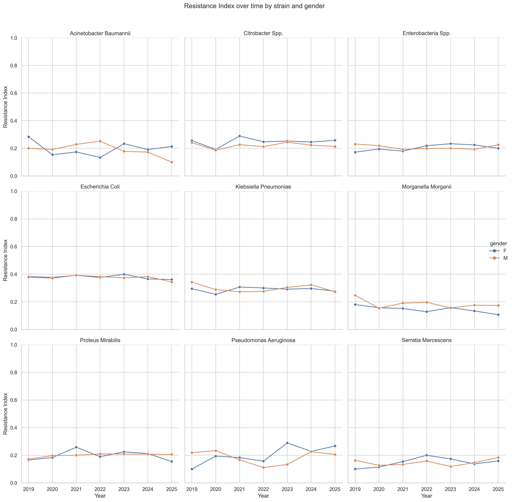
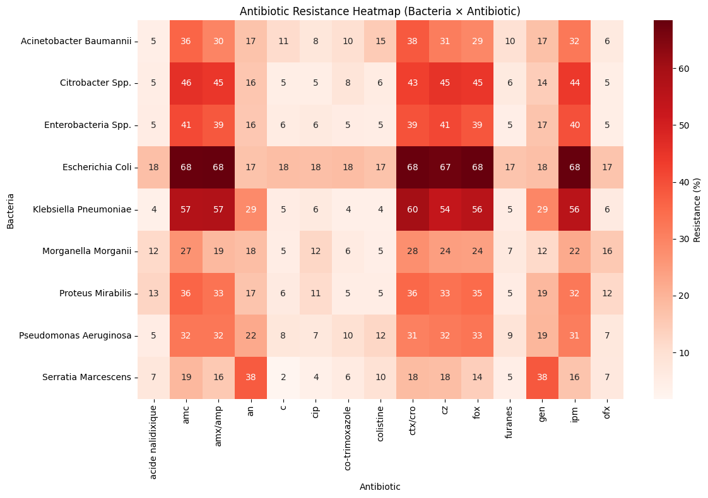
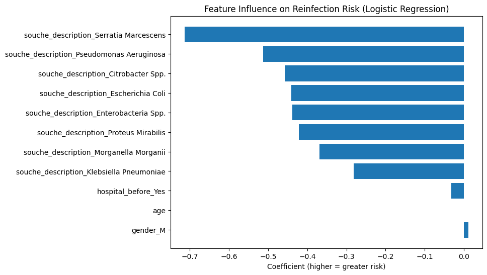

# Antibiotic Resistance: What a Dataset Can Reveal Before the First Prediction

We often talk about antibiotic resistance as if it were a distant threat — something happening inside hospitals, laboratories, or research centers, far from everyday life.  
But behind the scenes, thousands of microbiology tests are performed every single day, generating data that silently record how bacteria adapt, evolve, and sometimes outsmart our antibiotics.

When I began this project, my goal wasn’t just to “train a model.”  
I wanted to explore a simple but compelling question:

**How much can we learn about antibiotic resistance *before* applying machine learning?**

This post walks throughout that journey, from raw clinical records to a first baseline model to reveal what the data whispered long before the algorithm spoke.

---

## 1. Meeting the Dataset: Patients, Samples, Bacteria

This post walks through that journey, from raw clinical records to a first baseline model, revealing what the data whispered long before the algorithm spoke.

Before touching any model, I attempted to explore the big picture:  
*What does resistance look like in this dataset? How balanced are the classes? Who are the patients behind these tests?*

### Distribution of antibiotic test outcomes  

The dataset is **heavily dominated by “Sensitive” samples**.  
A detail that may seem trivial, but that alone shapes the entire modeling strategy, especially when the outcome we care about (resistance) is the minority.

---

## 2. Looking at the Human Side of the Data

Antibiotic resistance is a microbiological phenomenon, however it doesn’t exist without patients.  
So I turned to the demographic information.

### Age distribution  

A first glance showed a dataset that wasn’t “textbook clean”: peaks, gaps, and irregularities that hint at **real-world data entry** rather than curated research-grade inputs.  
This makes the analysis more challenging, but also more authentic.

## Trends Over Time: How Infections Evolve Across Bacterial Species

Before looking at resistance itself, I explored how infections evolved over the years for each bacterial strain, broken down by gender.  
This view doesn’t reveal resistance patterns, but it exposes **how different species fluctuate over time** , a dynamic often influenced by hospital practices, seasonal waves, and population demographics.

### Temporal trends by strain and gender  

Several species show clear peaks in specific years, while others remain relatively stable.  
Gender differences are generally subtle, but the temporal variability is significant. This could later interact with resistance patterns in more advanced models.

---

## 3. The Microbiological Core: Species and Sample Origin

### Resistance trends over time by strain and gender

To summarize resistance across all tested antibiotics, I computed a **Resistance Index** for each isolate — the proportion of antibiotics for which the result was “Resistant (R)”.  
Aggregating this index by bacterial strain, year, and gender reveals how resistance evolves over time.

### Observations

The Resistance Index reveals that most bacterial species maintain **stable resistance levels over time**, with only small fluctuations year to year.  
Gender differences are minimal, as male and female curves generally overlap across all strains.  

Each species, however, preserves its own characteristic profile:  
*E. coli* and *Klebsiella pneumoniae* show consistently moderate resistance, *Proteus mirabilis* and *Morganella morganii* display mild variability, while others remain largely steady.

Overall, no species exhibits a clear upward trend which suggests that susceptibility has stable patterns within the observed period.

### Correlation Heatmap  

There are no overwhelming correlations — a sign that the dataset is rich but not dominated by a single variable.  
Yet some patterns reflect meaningful clinical relationships, reinforcing the insights observed earlier.

---

## 5. A First Predictive Attempt: Logistic Regression

For this first iteration, I chose a **Logistic Regression** model.  
It’s not the most powerful algorithm, but it’s transparent, fast, and ideal for establishing a baseline.

### Model Performance
 
| Class | Precision | Recall | F1-Score | Support |
|-------|-----------|--------|----------|---------|
| **0** | 0.562 | 0.515 | 0.537 | 859 |
| **1** | 0.518 | 0.605 | 0.558 | 887 |
| **Accuracy** | — | — | **0.559** | 1746 |
| **Macro Avg** | 0.540 | 0.560 | 0.548 | 1746 |
| **Weighted Avg** | 0.540 | 0.559 | 0.548 | 1746 |

The accuracy settles around **50%**, which is exactly what you’d expect given:
- the imbalance between classes,
- the complexity of resistance mechanisms,
- the variability of clinical data.

Instead of chasing accuracy, I focused on **learning from the model** — specifically from the importance of its coefficients.

---

## 6. What the Model Thinks: Feature Importance

Logistic Regression provides an elegant window into which variables influence predictions.

### Top predictive features  

As intuition suggested, the model leans heavily on:
- **bacterial species**, and  
- **sample origin**,  

confirming that microbiological context outweighs demographic details.  
Even without high accuracy, the model helps crystallize the story that the data had been telling all along.

---

## 7. Final Thoughts: A Starting Point, Not a Destination

This analysis wasn’t meant to produce a perfect model.  
It was meant to **understand** the dataset — to listen to what it reveals before trying to force a result from it.

What emerged is a clear narrative:
- resistance patterns differ strongly between species,  
- sample types contribute meaningfully,  
- demographic variables play a secondary role,  
- and even a simple model can highlight the right signals.

The next steps are already mapped:
- tree-based models,  
- dealing with imbalance,  
- deeper feature engineering,  
- and integrating domain knowledge.

But the most important takeaway is this:  
**data analysis is not just about algorithms — it’s about discovering the story behind the data.**

This dataset had one to tell, long before the machine learning began.